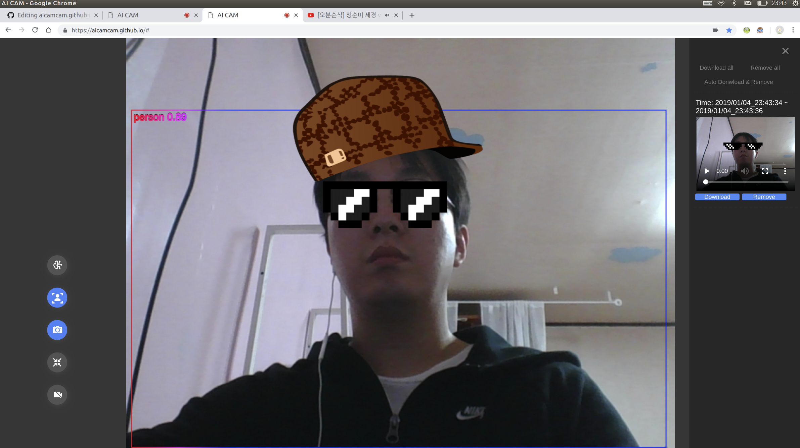

# aicamcam.github.io
Smart webcam service. Object(person/dog/cat) detection and record video. Running without any server connection. Powered by HTML5, Tensorflow.js

<<<<<<< HEAD

=======
[aicamcam_capture]()  
>>>>>>> dbbd590035b20f7eaec559e7762b7f5045baa792

### Tested Environment
Chrome - 71.0.3578.98
 
### How to use
#### 1. Configuration
<<<<<<< HEAD

=======
[setting from chrome]()  
>>>>>>> dbbd590035b20f7eaec559e7762b7f5045baa792
Please allow chrome to use "Webcam".  
If you want to auto download for recorded video, Please allow "Automatic Downloads".   

#### 2. Object detection  
<<<<<<< HEAD

=======
[object detection button]()  
>>>>>>> dbbd590035b20f7eaec559e7762b7f5045baa792
To test object detection, click "Test Object Detection" button. 
Loading TFJS model take 1~2 minutes.  
This button draw bounding box to video. 

#### 3. Smart Recording  
<<<<<<< HEAD

=======
[smart recording button]()  
>>>>>>> dbbd590035b20f7eaec559e7762b7f5045baa792
To start smart recording, click "Smart Recording" Button.  
During smart recording mode,   
If a object is detected, Recording is started.  
If the object disapear for 3 seconds, Recording is stoped.   
If recording is continued for 1 minute, Video is created and recording is re-started.  

#### 4. Recording 
<<<<<<< HEAD

=======
[recorded videos]()  
>>>>>>> dbbd590035b20f7eaec559e7762b7f5045baa792
To start recording, click "Recording" Button.  
This button start recording regardless of object detection. 
If recording is continued for 1 minute, Video is created and recording is re-started.  

#### 5. Navigator
<<<<<<< HEAD

=======
[Hamberger button]()  
>>>>>>> dbbd590035b20f7eaec559e7762b7f5045baa792
##### 5.1. video
Click "hamberger" button and check out the created video.   
User can download or remove video. 
The video hold system memory until user remove it.   
To save system memory, please download and remove video from navigator.   

<<<<<<< HEAD
##### 5.2. Auto download

=======
[auto_download]()  
##### 5.2. Auto download
>>>>>>> dbbd590035b20f7eaec559e7762b7f5045baa792
If you plan to use long-term recording, 
Click auto download and remove button.  

##### 5.3. download all and remove all 
Download all and remove all videos
