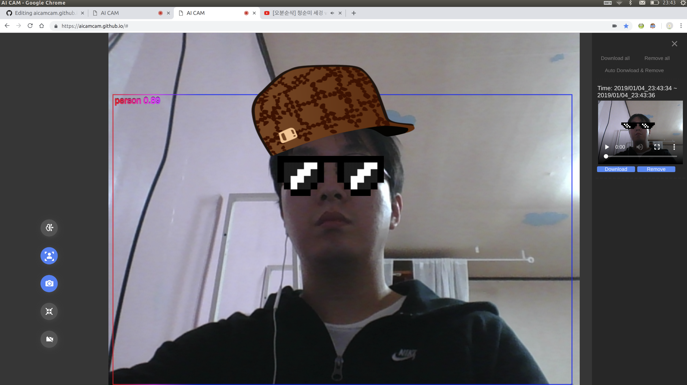
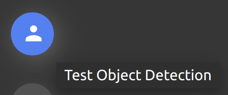
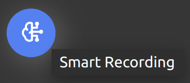
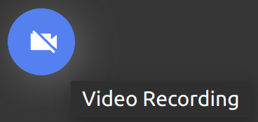
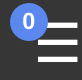
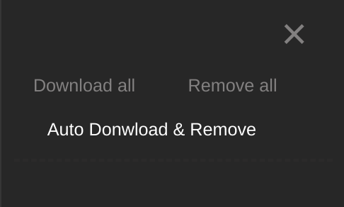

# aicamcam.github.io
 - 스마트 웹캠 서비스  
 - 객체인식(사람/강아지/고양이) 과 웹캠 녹화  
 - 객체인식 모델 로딩 이후 Off-line에서 사용 가능 
 - HTML5와 Tensorflow.js 사용  

[English](../README.md)  

### 테스트 환경
Chrome - 71.0.3578.98
 
### 사용법
#### 1. 환경 설정

크롬 브리우져 "Webcam" 사용 허용해 주세요.  
자동 비디오 다운로드 기능을 사용하시려면, 크롬 브라우져 "Automatic Downloads" 기능도 허용해 주세요.  

#### 2. Object detection  

객체인식 테스트 하시려면 "Test Object Detection" 버튼을 클릭해 주세요.  
Loading TFJS model take 1~2 minutes.  
TFJS 모델 로딩에 1-2분 정도 소요 됩니다.  
웹캠 화면에 바운딩 박스가 그려집니다.  

#### 3. Smart Recording  

스마트 리코딩을 시작하시려면 "Smart Recording" 버튼을 눌러 주세요.  
스마트 리코딩 모드에서는 객체가 인식되면 비디오 리코딩이 시작됩니다.  
객체가 화면에서 3초간 사라지면 리코딩은 정지되고 녹화된 웹캠영상은 비디오로 생성 됩니다.  
리코딩은 1분단위로 비디오로 저장되고, 리코딩은 재시작 됩니다.  

#### 4. Recording 

일반 리코딩을 시작하시려면 "Recording" 버튼을 눌러 주세요.   
객체인식과 무관하게 비디오가 리코딩 됩니다.  
리코딩은 1분단위로 비디오로 저장되고, 리코딩은 재시작 됩니다.  

#### 5. Navigator

##### 5.1. video
생성된 비디로를 확인하기 위해 "hamberger" 버튼을 클릭해 주세요.  
사용자는 비디오를 다운로드 하거나 지울 수 있습니다.  
생성된 비디오는 네비게이터 바에서 지워지기 전까지 메모리를 소비합니다.  
메모리를 아끼기 위해 비디오를 다운로드후 삭제해 주세요.  

##### 5.2. Auto download

만약 장시간 리코딩을 하시려면 "Auto Download & Remove" 을 클릭해 주세요.  

##### 5.3. download all and remove all 
전체 비디오 다운로드 혹은 전체 삭제  
